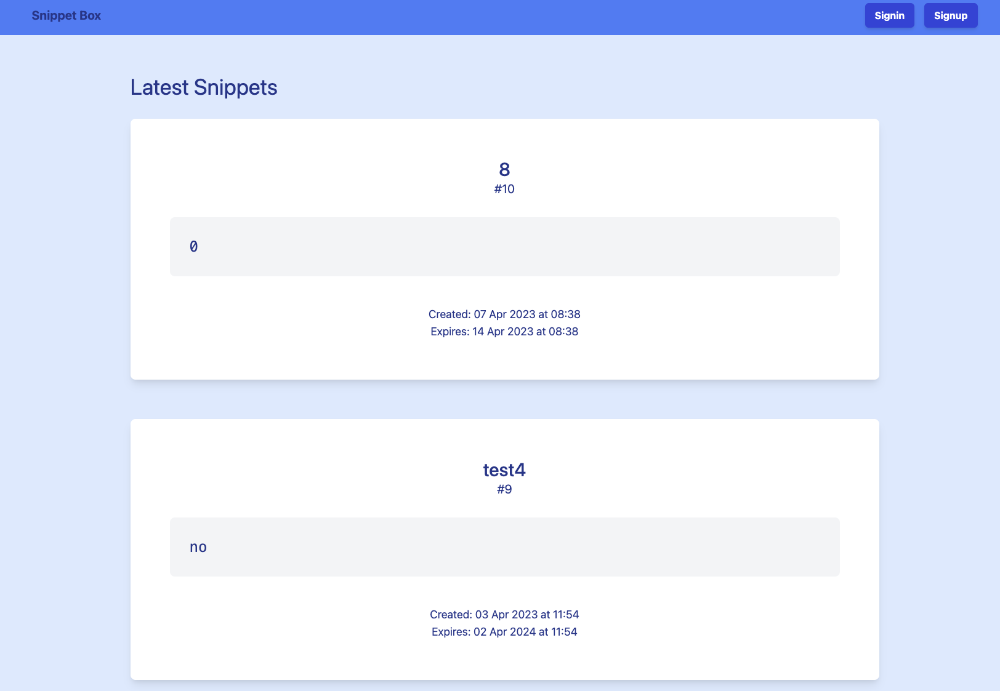
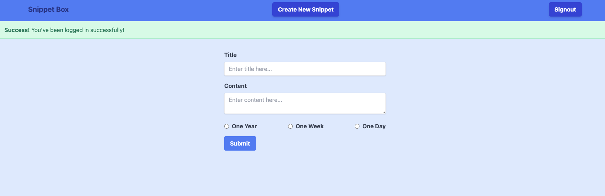

# Chapters
- [x] Introduction
- [x] Foundations
- [x] Configuration and error handling
- [x] Database-driven responses
- [x] Dynamic HTML templates
- [x] Middleware
- [x] Advanced routing
- [x] Processing forms
- [x] Stateful HTTP
- [x] Security improvements
- [x] User authentication
- [x] Using request context
- [x] Optional Go features

# TODO
- [ ] Tests
- [ ] Guided exercises